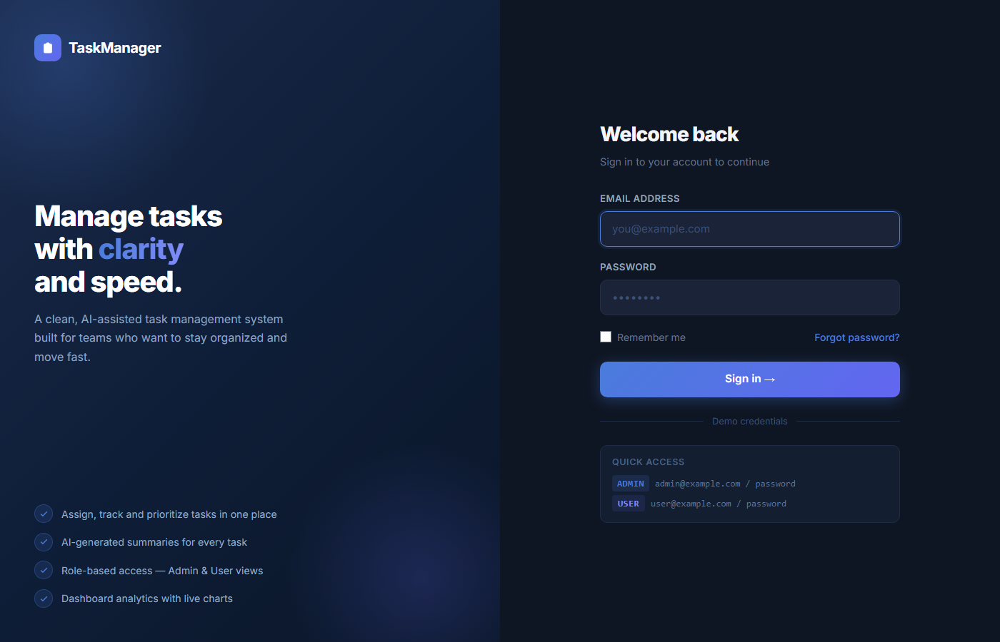
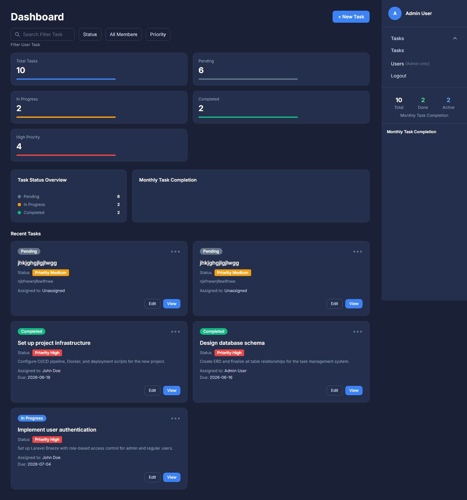
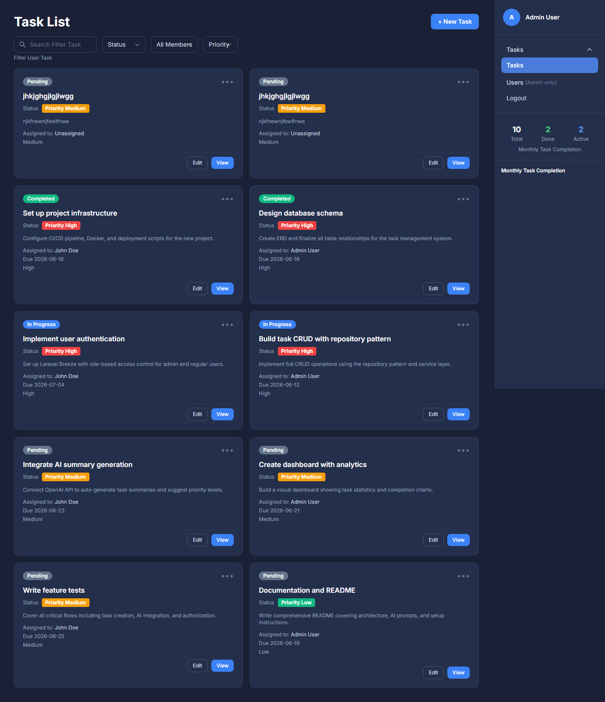

# AI-Assisted Task Management System

## About Project

This is a premium, production-ready AI-Assisted Task Management System built using **Laravel 11**, **Blade**, **Tailwind CSS**, and **MySQL**. It demonstrates advanced web application concepts, clean architecture, and modern AI integration — following the Repository Pattern, Service Layer, and strict separation of concerns.

### Core Architecture

This project is built utilizing robust software design patterns to ensure maintainability, testability, and decoupled logic:

- **Service Layer & Repository Pattern:** Business logic is abstracted into dedicated Services (`TaskService`, `AIService`), while all data access is handled exclusively through Repositories (`TaskRepositoryInterface`, `Eloquent/TaskRepository`). Controllers only handle HTTP request validation and response formatting — no direct Eloquent calls.

- **Form Request Validation Architecture:** Extensive use of strict, modular Form Requests (`StoreTaskRequest`, `UpdateTaskRequest`) that completely separate validation rules from Controller logic, keeping controllers clean and focused.

- **Repository Caching:** Implements intelligent caching with graceful degradation. `TaskRepository` caches list (`all()`) and single fetch (`find()`) queries. Write operations (`create`, `update`, `delete`) automatically invalidate the cache to ensure fresh data delivery without performance penalties.

- **Fine-grained RBAC Policy System:** Resources are protected dynamically using Laravel Policies (`TaskPolicy`). Admins retain full CRUD privileges, while regular Users are restricted to viewing and updating statuses on assigned tasks only.

- **Sanctum-Protected REST APIs:** Cross-platform integration ready via `/api/tasks` endpoints, secured with `auth:sanctum` middleware and returning standardised API Resources.

---

### AI Integration (OpenAI GPT-3.5)

The system leverages the **OpenAI API** for automated intelligent task insights:

- **Asynchronous Queue Workers:** The `GenerateAISummary` job is dispatched onto a database queue the moment a task is created. This keeps the HTTP response instant — AI processing happens entirely in the background.

- **Graceful Retries & Fallbacks:** The job is configured with `$tries = 3` and `$backoff = 30` seconds. If the OpenAI API is unreachable or returns an error, the `AIService` automatically falls back to a meaningful mock response, preventing any UI breakage.

- **Mock Mode:** Set `AI_MOCK=true` in your `.env` to run the full AI flow without consuming OpenAI credits — ideal for development and testing.

- **Insight Extraction:** The `AIService` constructs a structured prompt from the task title, description, current priority, status, and due date — instructing GPT-3.5-turbo to return a strict JSON payload containing a concise `summary` and an AI-recommended `priority` level.

**AI Prompt Template:**
```
Analyze this task and provide a brief summary and suggested priority.

Task Title: {title}
Description: {description}
Current Priority: {priority}
Status: {status}
Due Date: {due_date}

Respond with JSON: {"summary": "2-3 sentence summary", "priority": "low|medium|high"}
```

> ⚠️ AI is **never** called directly from a controller. The call chain is strictly:
> `TaskController` → `TaskService::store()` → `dispatch(GenerateAISummary)` → `AIService::generateSummary()`

---

### Folder Structure

```
app/
├── Http/
│   ├── Controllers/
│   │   ├── TaskController.php          # Web CRUD — delegates to TaskService
│   │   ├── DashboardController.php     # Analytics & stats
│   │   └── Api/
│   │       └── TaskApiController.php   # REST API endpoints
│   ├── Requests/
│   │   ├── StoreTaskRequest.php        # Validation + authorization check
│   │   └── UpdateTaskRequest.php
│   └── Resources/
│       └── TaskResource.php            # API response transformer
├── Models/
│   ├── Task.php                        # Enum casts, scopeFilter
│   └── User.php
├── Repositories/
│   ├── Contracts/
│   │   └── TaskRepositoryInterface.php # Contract — controllers depend on this
│   └── Eloquent/
│       └── TaskRepository.php          # Eloquent implementation + caching
├── Services/
│   ├── TaskService.php                 # Business logic, transactions, job dispatch
│   └── AIService.php                   # Prompt building, API call, mock fallback
├── Jobs/
│   └── GenerateAISummary.php           # Queued: calls AIService, updates task
├── Policies/
│   └── TaskPolicy.php                  # Gate checks: view, create, update, delete
├── Enums/
│   ├── TaskPriority.php                # low | medium | high
│   └── TaskStatus.php                  # pending | in_progress | completed
└── Providers/
    ├── AppServiceProvider.php          # Registers TaskPolicy
    └── RepositoryServiceProvider.php   # Binds interface → implementation
```

---

## Quick Start — Create and Run the Application

Follow these steps from scratch to get the application running on your machine. Choose **Option A** (local setup, recommended for reviewers) or **Option B** (Docker).

---

### Option A: Local Setup (Laragon / WAMP / XAMPP / Manual PHP)

#### Step 1 — Clone the Repository

Open a terminal (Command Prompt, PowerShell, or Git Bash) and run:

```bash
git clone https://github.com/ajithj720-arch/Taskmanagement.git
cd Taskmanagement
```

---

#### Step 2 — Install PHP Dependencies

```bash
composer install
```

This downloads all Laravel packages into the `vendor/` directory. Takes about 1–2 minutes.

---

#### Step 3 — Install JavaScript Dependencies

```bash
npm install
```

This installs Vue.js, Tailwind CSS, Vite, and other frontend packages into `node_modules/`.

---

#### Step 4 — Create the Environment File

```bash
cp .env.example .env
```

This creates your local configuration file. Open `.env` in a text editor and update the database section to match your local MySQL credentials:

```env
DB_CONNECTION=mysql
DB_HOST=127.0.0.1
DB_PORT=3306
DB_DATABASE=task_management
DB_USERNAME=root
DB_PASSWORD=
```

> **Laragon users:** The default MySQL credentials are `root` with an empty password — the `.env.example` already has these values, so no changes are needed.
>
> **XAMPP/WAMP users:** Same defaults usually apply (`root` / empty password). Adjust if you configured a password.

---

#### Step 5 — Create the Database

Create a MySQL database named `task_management`. You can do this via:

**Option 1 — Using the command line:**
```bash
mysql -u root -e "CREATE DATABASE IF NOT EXISTS task_management;"
```

**Option 2 — Using phpMyAdmin:**
1. Open http://localhost/phpmyadmin (Laragon/XAMPP)
2. Click "New" in the left sidebar
3. Enter `task_management` as the database name
4. Click "Create"

---

#### Step 6 — Generate the Application Key

```bash
php artisan key:generate
```

This generates a unique encryption key and writes it to your `.env` file. Laravel requires this to run.

---

#### Step 7 — Run Database Migrations and Seed Demo Data

```bash
php artisan migrate:fresh --seed
```

This will:
- Create all required database tables (users, tasks, sessions, cache, jobs, etc.)
- Seed the database with **2 demo users** and **8 sample tasks**

You should see output like:
```
Dropping all tables .............. DONE
Running migrations ............... DONE
Seeding database ................. DONE
```

---

#### Step 8 — Build Frontend Assets

```bash
npm run build
```

This compiles Vue.js components, Tailwind CSS, and all frontend assets into the `public/build/` directory.

> For active development with hot-reload, use `npm run dev` instead (keeps running in a terminal).

---

#### Step 9 — Start the Development Server

```bash
php artisan serve
```

You should see:
```
INFO  Server running on [http://127.0.0.1:8000].
```

> **Laragon users:** You can alternatively access the app via Laragon's auto virtual host (e.g., `http://task-mangement-system.test`) without running `php artisan serve`.

---

#### Step 10 — Start the Queue Worker (Required for AI Summaries)

Open a **second terminal** (keep the server running in the first one) and run:

```bash
php artisan queue:work --sleep=3 --tries=3
```

This processes background jobs. Without it, newly created tasks will show *"Processing in background queue..."* and the AI summary will never appear.

> The AI runs in **mock mode** by default (`AI_MOCK=true` in `.env`), so you do not need an OpenAI API key. To use real AI, set `AI_MOCK=false` and add your `OPENAI_API_KEY`.

---

#### Step 11 — Open the Application

Open your browser and navigate to:

**http://localhost:8000**

Log in with one of the seeded demo accounts:

| Role | Email | Password | What You Can Do |
|------|-------|----------|-----------------|
| **Admin** | `admin@example.com` | `password` | Full access — create, edit, delete all tasks; manage users |
| **Regular User** | `user@example.com` | `password` | View assigned tasks and update their status only |

---

#### Step 12 — Run Tests (Optional)

To verify everything is working correctly:

```bash
php artisan test
```

Or run a specific test file:
```bash
./vendor/bin/phpunit tests/Feature/TaskTest.php
```

---

### Option B: Using Docker

#### Prerequisites

- Docker Desktop — https://www.docker.com/products/docker-desktop/
- Make sure Docker Desktop is running before proceeding (Docker icon visible in system tray)

---

#### Step 1 — Clone the Repository

```bash
git clone https://github.com/ajithj720-arch/Taskmanagement.git
cd Taskmanagement
```

---

#### Step 2 — Setup the Environment File

```bash
cp .env.docker .env
```

This copies the pre-configured Docker environment file. It already has:
- `DB_HOST=db` — points to the MySQL container
- `DB_USERNAME=taskuser` / `DB_PASSWORD=secret` — matches container credentials
- `APP_ENV=production` — serves pre-built assets without needing a Vite dev server

> Do **not** use `.env.example` for Docker — it points to `127.0.0.1` which won't work inside containers.

---

#### Step 3 — Build the Docker Images

```bash
docker compose build
```

This builds the PHP 8.3-FPM application image, installs Composer dependencies, and sets permissions. Takes 1–2 minutes on first run.

---

#### Step 4 — Start All Containers

```bash
docker compose up -d
```

This starts 3 containers:

| Container | Role | Port |
|---|---|---|
| `taskmanager_app` | PHP 8.3-FPM (runs Laravel) | 9000 (internal) |
| `taskmanager_nginx` | Nginx (serves the web app) | **8090 → 80** |
| `taskmanager_db` | MySQL 8.0 (database) | **3307 → 3306** |

> **Note:** Ports `8090` and `3307` are used to avoid conflicts with locally running services (Laragon, XAMPP, etc. typically use `8000` and `3306`).

---

#### Step 5 — Wait for Startup to Complete

The app container automatically installs dependencies, runs migrations, seeds data, and clears caches. This takes **1–2 minutes** on first run. Watch progress with:

```bash
docker compose logs -f app
```

The app is ready when you see:
```
==> Starting PHP-FPM...
[...] NOTICE: ready to handle connections
```

Press `Ctrl+C` to stop following logs.

---

#### Step 6 — Open the Application

Open your browser: **http://localhost:8090**

| Role | Email | Password |
|------|-------|----------|
| **Admin** | `admin@example.com` | `password` |
| **Regular User** | `user@example.com` | `password` |

---

#### Step 7 — Start the AI Queue Worker

Open a new terminal:

```bash
docker compose exec app php artisan queue:work --sleep=3 --tries=3
```

---

#### Stop / Restart

```bash
docker compose down        # Stop all containers
docker compose up -d       # Restart
docker compose down -v     # Stop and delete database volume (full reset)
```

---

#### Run Tests (Docker)

```bash
docker compose exec app php artisan test
```

---

## API Endpoints

All API routes require `auth:sanctum` authentication.

| Method | Endpoint | Description |
|--------|----------|-------------|
| GET | `/api/tasks` | Paginated task list with filters |
| POST | `/api/tasks` | Create a new task |
| PATCH | `/api/tasks/{id}/status` | Update task status |
| GET | `/api/tasks/{id}/ai-summary` | Refresh and return AI summary |

---

## Roles & Permissions

| Action | Admin | Task Creator | Assignee | Other |
|--------|-------|-------------|----------|-------|
| View task list | ✅ | ✅ | ✅ | ✅ |
| View specific task | ✅ | ✅ | ✅ | ❌ |
| Create task | ✅ | ✅ | ✅ | ✅ |
| Edit task | ✅ | ✅ | ❌ | ❌ |
| Delete task | ✅ | ✅ | ❌ | ❌ |
| Update status | ✅ | ✅ | ✅ | ❌ |
| Manage users | ✅ | ❌ | ❌ | ❌ |

---

## Tech Stack

- **Backend:** Laravel 11, PHP 8.3
- **Frontend:** Blade, Tailwind CSS, Chart.js
- **Database:** MySQL 8.0
- **Queue:** Laravel database queue
- **AI:** OpenAI GPT-3.5-turbo (with mock fallback via `AI_MOCK=true`)
- **Auth:** Laravel Breeze (session-based)
- **API Auth:** Laravel Sanctum
- **Containerisation:** Docker (PHP-FPM + Nginx + MySQL)

---

## Screenshots

### Login Page


### Dashboard (Analytics & Charts)


### Task List Page


---

## Common Fixes

### 1. 502 Bad Gateway (Docker)
The app container takes **1–2 minutes** to fully boot on first run (installing dependencies, running migrations, seeding data). Wait for PHP-FPM to be ready:
```bash
docker compose logs -f app
```
The app is ready when you see `NOTICE: ready to handle connections`. Refresh your browser after that.

### 2. Port Already in Use (Docker)
If you see `Bind for 0.0.0.0:8090 failed: port is already allocated`, another service is using that port. Either stop the conflicting service, or change the port in `docker-compose.yml`:
```yaml
ports:
  - "9090:80"   # Change 8090 to any free port
```

### 3. Database Connection Refused
**Docker:** Ensure the MySQL container is running:
```bash
docker compose ps
docker compose up -d db
```
**Local:** Verify port `3306` and credentials inside `.env`. Make sure your MySQL service is running.

### 4. Queue Jobs Not Processing (AI summaries stuck)
Make sure `queue:work` is actively running:
```bash
# Docker
docker compose exec app php artisan queue:work --sleep=3 --tries=3

# Local
php artisan queue:work --sleep=3 --tries=3
```
Check failed jobs:
```bash
php artisan queue:failed
```

### 5. Asset Styles Not Displaying (Local)
Compile the assets to ensure Tailwind CSS is fully built:
```bash
npm run build
```
> Docker users: frontend assets are pre-built and committed to the repository — no `npm` commands needed.

### 6. Rebuild Everything from Scratch (Docker)
```bash
docker compose down -v
docker compose build --no-cache
docker compose up -d
```
